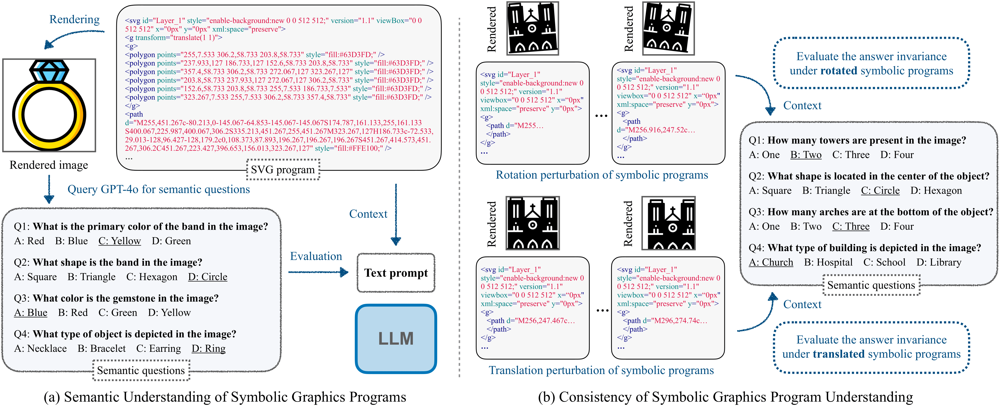

# SGP-Bench

Here is the official evaluation code of SGP-Bench (Paper: Can Large Language Models Understand Symbolic Graphics Programs?)



Project Link: [https://sgp-bench.github.io](https://sgp-bench.github.io)

## Table of Contents

- [Installation](#installation)
- [Usage](#usage)
- [License](#license)
- [Contact](#contact)


## Data

The data used for evaluation or instruction tuning will be automatically downloaded by running `load_dataset` from huggingface datasets.

```python
# SGP-Bench
load_dataset('sgp-bench/sgp-bench', split=split)
load_dataset('sgp-bench/sgp-mnist', split='mnist')
# SIT data
load_dataset('sgp-bench/sit_10k')
load_dataset('sgp-bench/sit_25k')
load_dataset('sgp-bench/sit_40k')
load_dataset('sgp-bench/sit_55k')
load_dataset('sgp-bench/sit_72k')
load_dataset('sgp-bench/rev_sit_10k')
load_dataset('sgp-bench/rev_sit_25k')
load_dataset('sgp-bench/rev_sit_40k')
load_dataset('sgp-bench/rev_sit_55k')
load_dataset('sgp-bench/rev_sit_72k')
load_dataset('sgp-bench/mixed_sit_10k')
load_dataset('sgp-bench/mixed_sit_25k')
load_dataset('sgp-bench/mixed_sit_40k')
load_dataset('sgp-bench/mixed_sit_55k')
load_dataset('sgp-bench/mixed_sit_72k')
```

We also provide the data as `csv` files in the following [link
](https://drive.google.com/drive/folders/1yZA7SKVCscai1tY_Zpoy4XgdR27Rddg1?hl=de).


## Installation

Run the following command to set up the conda environment.


```bash
git clone https://github.com/sgp-bench/sgp-bench.git
cd sgp-bench
conda env create -f environment.yml
```


## Usage

### Evaluate closed-sourced model
We provide examples of evaluating OpenAI api and Claude api:

```bash
python -m sgp-bench.demo --api $API --model_path $MODEL_PATH --eval $EVAL

# GPT
python -m sgp-bench.demo --api openai-4o

# Claude
python -m sgp-bench.demo --api claude-3.5-sonnet
```

### Evaluate open-sourced model with vLLM
We use [vLLM](https://github.com/vllm-project/vllm) as framework to evaluate open-source LLMs, for more information, please refer to [OpenAI Compatible Server
](https://docs.vllm.ai/en/stable/serving/openai_compatible_server.html).


```bash
python -m sgp-bench.demo --base_url $BASE_URL --api $API --model $MODEL --eval $EVAL

# example usage Llama 3 8B
python -m sgp-bench.demo --base_url http://172.22.8.4:8000/v1 --api llama3-8B --model meta-llama/Meta-Llama-3-8B --eval svg cad
```

Note, the 
* **$BASE_URL**: the IP address of the server where the open-source LLM is running, you can use the Linux command `hostname -i` to get the IP address of the remote machine.
* **$API**: an identifier of the open-source LLM.
* **$MODEL_PATH**: the model path, either the local path where the model is stored or the HuggingFace model name, e.g., `meta-llama/Meta-Llama-3-8B`.
* **$EVAL**: which task to evaluate, possible tasks are `svg`, `cad`, `inv` and `mnist`. For more information, please refer to the paper.

You have to set up the server at **$BASE_URL** beforehand. Here we list some examples of setting up the open-source models we evaluated in the paper:


```bash
# llama3-8B
python -m vllm.entrypoints.openai.api_server --model meta-llama/Meta-Llama-3-8B --dtype auto --api-key token-abc123 --tensor-parallel-size 8

# llama3-70B
python -m vllm.entrypoints.openai.api_server --model meta-llama/Meta-Llama-3-70B-Instruct --dtype auto --api-key token-abc123 --tensor-parallel-size 8


# llama3.1-8B
python -m vllm.entrypoints.openai.api_server --model meta-llama/Meta-Llama-3.1-8B-Instruct --dtype auto --api-key token-abc123 --tensor-parallel-size 8

# llama3.1-70B
python -m vllm.entrypoints.openai.api_server --model meta-llama/Meta-Llama-3.1-70B-Instruct --dtype auto --api-key token-abc123 --tensor-parallel-size 8

# llama3.1-405B
python -m vllm.entrypoints.openai.api_server --model meta-llama/Meta-Llama-3.1-405B-Instruct-FP8 --dtype auto --api-key token-abc123 --tensor-parallel-size 8 --max-model-len 8192


# gemma-1.1-2b
python -m vllm.entrypoints.openai.api_server --model google/gemma-1.1-2b-it --dtype auto --api-key token-abc123 --tensor-parallel-size 8

# gemma-1.1-7b
python -m vllm.entrypoints.openai.api_server --model google/gemma-1.1-7b-it --dtype auto --api-key token-abc123 --tensor-parallel-size 8


# mistral-7B-v0.3
python -m vllm.entrypoints.openai.api_server --model mistralai/Mistral-7B-Instruct-v0.3 --dtype auto --api-key token-abc123 --tensor-parallel-size 8

# mistral-codestral-22b-v0.1
python -m vllm.entrypoints.openai.api_server --model mistralai/Codestral-22B-v0.1 --dtype auto --api-key token-abc123 --tensor-parallel-size 8

# mistral-large
python -m vllm.entrypoints.openai.api_server --model mistralai/Mistral-Large-Instruct-2407 --dtype auto --api-key token-abc123 --tensor-parallel-size 8

# mistral-nemo
python -m vllm.entrypoints.openai.api_server --model mistralai/Mistral-Nemo-Instruct-2407 --dtype auto --api-key token-abc123 --tensor-parallel-size 8


# c4ai-command-r-v01
python -m vllm.entrypoints.openai.api_server --model CohereForAI/c4ai-command-r-v01 --dtype auto --api-key token-abc123 --tensor-parallel-size 8

# c4ai-command-r-plus
python -m vllm.entrypoints.openai.api_server --model CohereForAI/c4ai-command-r-plus --dtype auto --api-key token-abc123 --tensor-parallel-size 8

# CohereForAI/aya-23-8B
python -m vllm.entrypoints.openai.api_server --model CohereForAI/aya-23-8B --dtype auto --api-key token-abc123 --tensor-parallel-size 8 

# CohereForAI/aya-23-35B
python -m vllm.entrypoints.openai.api_server --model CohereForAI/aya-23-35B --dtype auto --api-key token-abc123 --tensor-parallel-size 8


# starcoder2-15b-instruct-v0.1
python -m vllm.entrypoints.openai.api_server --model bigcode/starcoder2-15b-instruct-v0.1 --dtype auto --api-key token-abc123 --tensor-parallel-size 8


# internlm2_5-7b-chat
python -m vllm.entrypoints.openai.api_server --model internlm/internlm2_5-7b-chat --trust-remote-code --dtype auto --api-key token-abc123  --tensor-parallel-size 8

# internlm2-chat-20b
python -m vllm.entrypoints.openai.api_server --model internlm/internlm2-chat-20b --trust-remote-code --dtype auto --api-key token-abc123  --tensor-parallel-size 8

# internlm2-chat-7b
python -m vllm.entrypoints.openai.api_server --model internlm/internlm2-chat-7b --trust-remote-code --dtype auto --api-key token-abc123  --tensor-parallel-size 8


# qwen-1.5-7B
python -m vllm.entrypoints.openai.api_server --model Qwen/Qwen1.5-7B-Chat --dtype auto --api-key token-abc123 --tensor-parallel-size 8

# qwen-1.5-32B
python -m vllm.entrypoints.openai.api_server --model Qwen/Qwen1.5-32B-Chat --dtype auto --api-key token-abc123 --tensor-parallel-size 8

# qwen-1.5-72B
python -m vllm.entrypoints.openai.api_server --model Qwen/Qwen1.5-72B-Chat --dtype auto --api-key token-abc123 --tensor-parallel-size 8

# qwen-1.5-110B
python -m vllm.entrypoints.openai.api_server --model Qwen/Qwen1.5-110B-Chat --dtype auto --api-key token-abc123 --tensor-parallel-size 8

# codeqwen-1.5-7B
python -m vllm.entrypoints.openai.api_server --model Qwen/CodeQwen1.5-7B-Chat --dtype auto --api-key token-abc123 --tensor-parallel-size 8

# qwen-2-72B
python -m vllm.entrypoints.openai.api_server --model Qwen/Qwen2-72B-Instruct --dtype auto --api-key token-abc123 --tensor-parallel-size 8


# Yi-1.5-9B
python -m vllm.entrypoints.openai.api_server --model 01-ai/Yi-1.5-9B-Chat-16K --dtype auto --api-key token-abc123 --tensor-parallel-size 8

# Yi-1.5-34B
python -m vllm.entrypoints.openai.api_server --model 01-ai/Yi-1.5-34B-Chat-16K --dtype auto --api-key token-abc123 --tensor-parallel-size 8


# DeepSeek-Coder-V2-16B
python -m vllm.entrypoints.openai.api_server --model deepseek-ai/DeepSeek-Coder-V2-Lite-Instruct --trust-remote-code  --dtype auto --api-key token-abc123 --tensor-parallel-size 8
```


## License

This project is licensed under the MIT License - see the [LICENSE](LICENSE) file for details.

## Contact

Zeju Qiu - [zeju.qiu@gmail.com](mailto:zeju.qiu@gmail.com)

## Citation

If you find our project interesting, please cite us 😊

```bibtex
@misc{qiu2024largelanguagemodelsunderstand,
  title={Can Large Language Models Understand Symbolic Graphics Programs?},
  author={Zeju Qiu and Weiyang Liu and Haiwen Feng and Zhen Liu and Tim Z. Xiao and Katherine M. Collins and Joshua B. Tenenbaum and Adrian Weller and Michael J. Black and Bernhard Schölkopf},
  year={2024},
  eprint={2408.08313},
  archivePrefix={arXiv},
  primaryClass={cs.LG},
  url={https://arxiv.org/abs/2408.08313},
}
```

## Acknowledgements

This project is based on the open-source repository available at https://github.com/openai/simple-evals. We are thankful to OpenAI for providing the base implementation.
